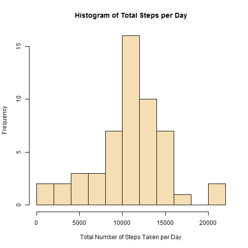
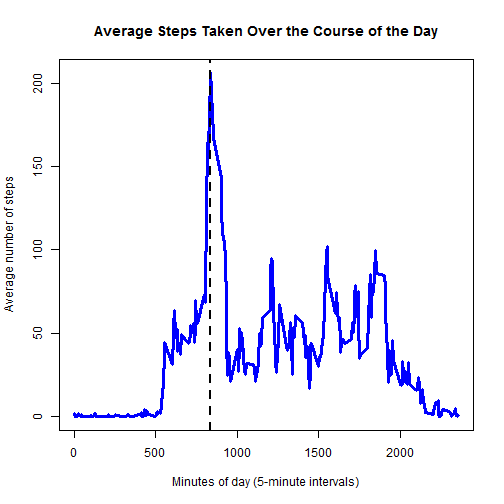
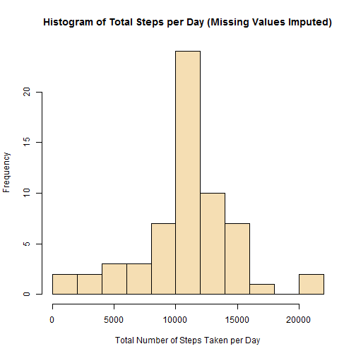
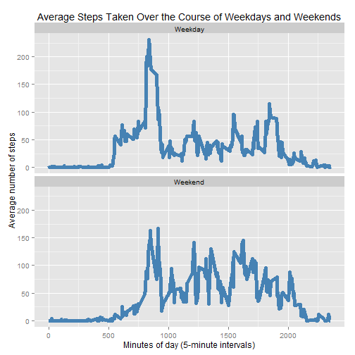

## Loading and preprocessing the data
1. Load the data

Note that the data is a zipped file.

```r
data <- read.csv(unzip("activity.zip"), stringsAsFactors = FALSE)
```
2. Process the data

It will be helpful to have formatted dates.

```r
data$date <- as.Date(data$date, "%Y-%m-%d")
data <- data[c("date", "interval", "steps")]
```


## What is mean total number of steps taken per day?
1. The total number of steps taken per day:

```r
library(dplyr)
by_day <- group_by(data[!is.na(data$steps), ], date)
stepsPerDay <- summarise(by_day, totalSteps = sum(steps))
head(stepsPerDay)
```

```
## Source: local data frame [6 x 2]
## 
##         date totalSteps
## 1 2012-10-02        126
## 2 2012-10-03      11352
## 3 2012-10-04      12116
## 4 2012-10-05      13294
## 5 2012-10-06      15420
## 6 2012-10-07      11015
```
2. Distribution of the total number of steps taken by day:

```r
hist(stepsPerDay$totalSteps, xlab = "Total Number of Steps Taken per Day",
     col = "wheat", breaks = 10, main = "Histogram of Total Steps per Day")
```

 

3. The mean of the total number of steps per day is:

```r
mean(stepsPerDay$totalSteps)
```

```
## [1] 10766.19
```
and the median of the total number of steps per day is:

```r
median(stepsPerDay$totalSteps)
```

```
## [1] 10765
```


## What is the average daily activity pattern?
1. Time series plot of the 5-minute interval and the average number of steps taken, averaged across all days:

```r
by_interval <- group_by(data, interval)
stepsPerInterval <- summarise(by_interval, AvgSteps = mean(steps, na.rm = TRUE))
plot(stepsPerInterval$interval, stepsPerInterval$AvgSteps,
     type = "l", lwd = 3, col = "blue",
     xlab = "Minutes of day (5-minute intervals)", ylab = "Average number of steps",
     main = "Average Steps Taken Over the Course of the Day")
abline(v = arrange(stepsPerInterval, desc(AvgSteps))[1,1], lwd = 2, lty = 2)
```

 

2. As indicated by the vertical line in the plot, the 5-minute interval, on average across all days in the dataset, containing the maximum number of steps (along with that average number of steps) is:

```r
arrange(stepsPerInterval, desc(AvgSteps))[1, ]
```

```
## Source: local data frame [1 x 2]
## 
##   interval AvgSteps
## 1      835 206.1698
```


## Imputing missing values

1. The total number of missing values in the dataset set is:

```r
sum(is.na(data$steps))
```

```
## [1] 2304
```
2. To address these missing values, I impute values using the mean for the given 5-minute interval, as calculated above.
3. Following this imputation strategy, I create a new dataset, identical to the original, but with the missing values filled in.  Thus we have:

```r
valuesForImputing <- as.data.frame(stepsPerInterval)
filledData <- merge(data, valuesForImputing, by = "interval", sort = FALSE)
filledData$steps[is.na(filledData$steps)] <- filledData$AvgSteps[is.na(filledData$steps)]
filledData <- filledData[order(filledData$date, filledData$interval), ]
data2 <- data.frame(filledData$date, filledData$interval, filledData$steps)
colnames(data2) <- c("date", "interval", "steps")
head(data2)
```

```
##         date interval     steps
## 1 2012-10-01        0 1.7169811
## 2 2012-10-01        5 0.3396226
## 3 2012-10-01       10 0.1320755
## 4 2012-10-01       15 0.1509434
## 5 2012-10-01       20 0.0754717
## 6 2012-10-01       25 2.0943396
```
4. The effect of imputing missing data: With the new dataset (with missing values imputed, as described above), I create a new histogram and new calculations for the mean and median:
* Histogram:

```r
by_day2 <- group_by(data2, date)
stepsPerDay2 <- summarise(by_day2, totalSteps = sum(steps))
hist(stepsPerDay2$totalSteps, xlab = "Total Number of Steps Taken per Day",
     col = "wheat", breaks = 10, main = "Histogram of Total Steps per Day (Missing Values Imputed)")
```

 

* Mean:

```r
mean(stepsPerDay2$totalSteps)
```

```
## [1] 10766.19
```
* Median:

```r
median(stepsPerDay2$totalSteps)
```

```
## [1] 10766.19
```
Thus, the missing data does not have much of an impact on the estimates of the total number of daily steps, compared with just ignoring missing values. The mean and median are little changed.  The distribution does seem to be a bit more tightly clustered in the middle.

## Are there differences in activity patterns between weekdays and weekends?

1. I create a new weekday/weekend indicator.

```r
data2$day <- factor(weekdays(data2$date) %in% c("Saturday", "Sunday"),
                     labels = c("Weekday", "Weekend"))
```
2. Consider the following panel plot showing the time series of average steps in five-minute intervals on weekdays and weekends:

```r
by_interval2 <- group_by(data2, day, interval)
stepsPerInterval2 <- summarise(by_interval2, AvgSteps = mean(steps))
library(ggplot2)
g <- ggplot(stepsPerInterval2, aes(interval, AvgSteps))
g + facet_wrap(~day, ncol = 1) + geom_line(color = "steelblue", lwd = 2) + 
        labs(x = "Minutes of day (5-minute intervals)", 
             y = "Average number of steps") +
        ggtitle("Average Steps Taken Over the Course of Weekdays and Weekends")
```

 

The average number of steps thus reaches a higher peak during weekdays, and the peak interval is less prominent on weekends.
